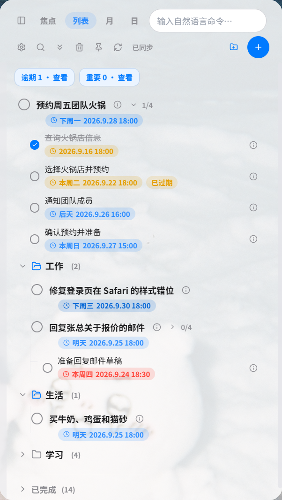
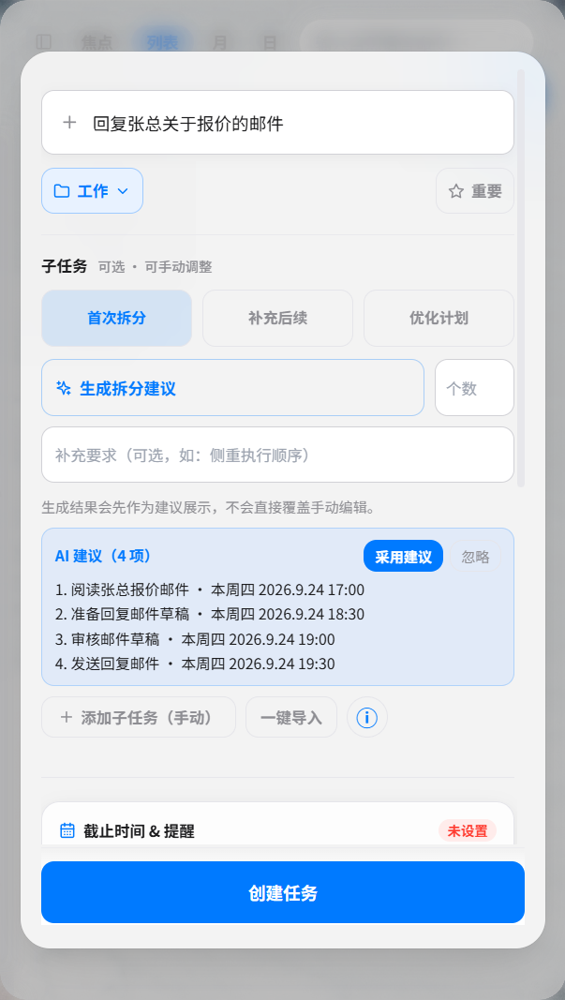
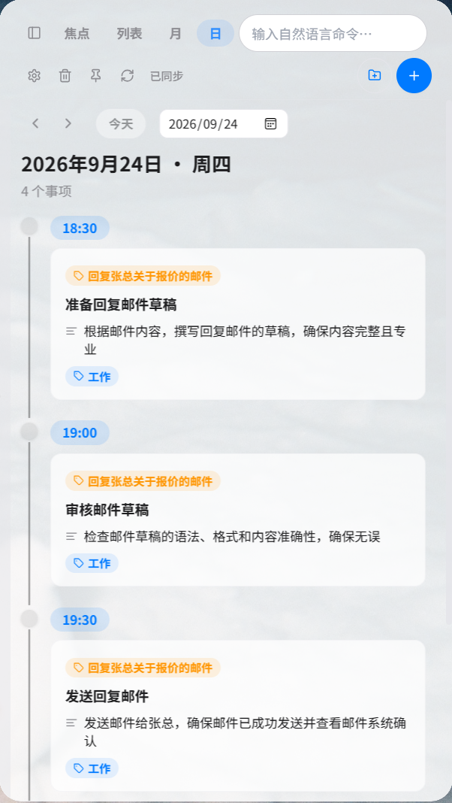

# HiTask

跨平台任务管理器，提供 Windows 桌面层任务面板、Android 桌面小部件和 WebDAV 双向同步。应用以本地 SQLite 为核心存储，支持自然语言录入、文件夹与子任务、截止时间管理和系统提醒。

当前版本：**V2.0.0**（2026-09-23）

## 产品预览

### Windows 桌面端







### Android 移动端

https://github.com/user-attachments/assets/bef0337b-2def-4e68-9d86-688ab0db2d02

## 核心能力

### Windows 桌面端

- WorkerW 桌面层嵌入，常驻显示且不占用任务栏
- 焦点、列表、月历、日视图四种任务视图
- 文件夹与子任务管理，支持重要任务置顶
- 自然语言创建任务并解析开始、截止时间
- 截止时间紧迫度颜色提示、系统通知和提醒偏移
- 右键操作菜单、托盘菜单和全局快捷键
- 可选开机自启动、窗口状态记忆及本地 SQLite 存储

### Android 端

- 静态 RemoteViews 小部件，按小部件尺寸分页展示任务
- 小部件内快速新建任务、切换完成和刷新
- 支持浅色/深色主题与透明度设置
- 与应用共享 SQLite 数据库，无需额外网络服务

### 同步与扩展

- WebDAV 双向合并同步，按记录版本合并并传播删除状态
- gzip 压缩、失败重试和定时同步
- 可选 OpenAI 兼容接口，用于自然语言任务解析与子任务生成

## 安装

### Windows

从 [v2.0.0 Release](https://github.com/Gloomwood-Hills/Desktop-Task-Manager/releases/tag/v2.0.0) 下载 `DesktopTaskManager-v2.0.0.exe`（便携版）或安装包。

### Android

下载 `DesktopTaskManager-arm64-release.apk` 安装；随后在桌面添加“HiTask”小部件。

## 开发

环境要求：Node.js 18+、Rust stable；Android 构建另需 JDK 21、Android SDK 与 NDK。

```bash
npm install
npm run dev       # Vite 开发服务器
npm run tauri dev # Tauri 桌面调试
npm run build     # 前端生产构建
npm run release   # Windows 发布构建
npm test          # 单元测试
```

Android 小部件工程位于 `src-tauri/gen/android/`，使用 Gradle 构建 arm64 release APK。

## 技术栈

- Tauri 2、Rust、WebView2
- React 18、TypeScript、Vite、Tailwind CSS
- motion（界面动效）
- SQLite（桌面端与 Android 小部件共享）
- reqwest（WebDAV）
- Kotlin、RemoteViews、AppWidgetProvider（Android 小部件）
- Vitest（测试）

## 数据与隐私

任务数据默认保存在本地 SQLite；WebDAV 同步需用户主动配置。应用不要求注册账号，也不收集用户数据。

## 文档

- [技术文档](TECHNICAL.md)
- [更新日志](CHANGELOG.md)

## 许可证

MIT
